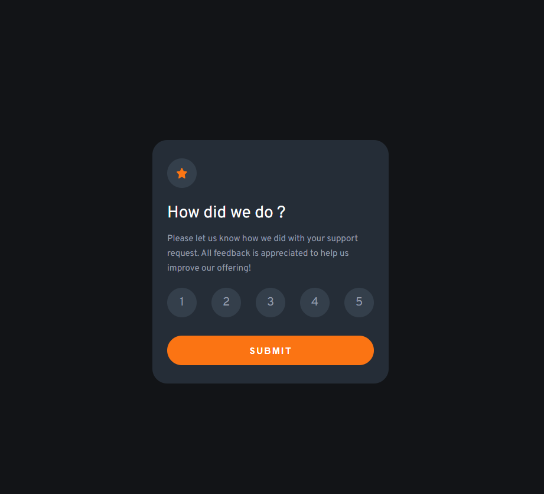

# Frontend Mentor - Interactive rating component solution

This is a solution to the [Interactive rating component challenge on Frontend Mentor](https://www.frontendmentor.io/challenges/interactive-rating-component-koxpeBUmI). Frontend Mentor challenges help you improve your coding skills by building realistic projects. 

## Table of contents

- [Overview](#overview)
  - [The challenge](#the-challenge)
  - [Screenshot](#screenshot)
  - [Links](#links)
- [My process](#my-process)
  - [Built with](#built-with)
  - [What I learned](#what-i-learned)
  - [Continued development](#continued-development)
  - [Useful resources](#useful-resources)
- [Author](#author)

## Overview

### The challenge

Users should be able to:

- View the optimal layout for the app depending on their device's screen size
- See hover states for all interactive elements on the page
- Select and submit a number rating
- See the "Thank you" card state after submitting a rating

### Screenshot



### Links

- Solution URL: [https://www.frontendmentor.io/solutions/interactive-rating-component-using-html-css-and-javascript-LkWIoVYGzY](https://www.frontendmentor.io/solutions/interactive-rating-component-using-html-css-and-javascript-LkWIoVYGzY)
- Live Site URL: [https://thiago87dev.github.io/interactive-rating-component/](https://thiago87dev.github.io/interactive-rating-component/)

## My process

### Built with

- Semantic HTML5 markup
- CSS custom properties
- Flexbox
- Javascript

### What I learned

I learned how to use 'forEach' and arrow function

```js
num.forEach(i => {
    i.addEventListener('click',() =>{
        let texto = document.querySelector('.rating-text')
        let valor = i.textContent;
        for(j = 0; j < num.length; j++){
            num[j].style.backgroundColor = ''
        }
        i.style.backgroundColor = "hsl(216, 12%, 54%)"
        texto.innerHTML = `You selected ${valor} out of 5`
        nota = valor
    })
})
```

### Continued development

forEach
arrow function

### Useful resources

- [forEach resource](https://www.devmedia.com.br/javascript-foreach-executando-uma-funcao-para-cada-elemento-de-um-array/39808) - this article helped me to understand more about forEach

## Author

- GitHub - [Thiago Alves](https://github.com/Thiago87dev)
- Frontend Mentor - [@MrThiago87](https://www.frontendmentor.io/profile/MrThiago87)
- Instagram - [@thiagopaulista87](https://www.instagram.com/thiagopaulista87/)

